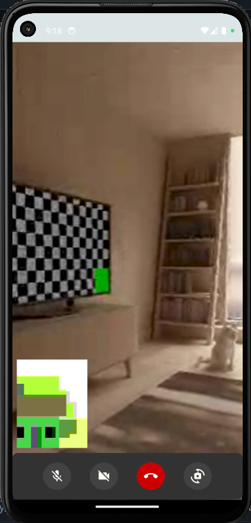

# ChatFusion

ChatFusion is a feature-rich chatting application that allows users to chat, send friend requests, accept requests, send attachments (photos, videos, and PDFs), and watch movies or videos together by pasting the link of the video. This project is developed using Android Studio for the frontend, Firebase for the backend, and WebRTC for video calls.

## Features

- **Chatting:** Real-time messaging with friends.
- **Friend Requests:** Send and accept friend requests.
- **Attachments:** Send photos, videos, and PDF files.
- **Watch Together:** Watch movies or videos together by pasting a link.
- **Video Calls:** High-quality video calls using WebRTC.

## Technologies Used

- **Frontend:** Android Studio
- **Backend:** Firebase
- **Video Calls:** WebRTC

## Screenshots

  

    <h3>Splash Screen</h3>
    
  

  

    <h3>Login Screen</h3>
    
  

  

    <h3>Sign Up Screen</h3>
    
  

  

    <h3>Home Screen</h3>
    
  

  

    <h3>Chat Screen</h3>
    
  

  

    <h3>Video Call Screen</h3>
    
  

  

    <h3>Profile Screen</h3>
    
  

   

    <h3>Personal Profile Screen</h3>
    
  

   

    <h3>Add Friend Screen 1</h3>
    
  

    

    <h3>Add Friend Screen 2</h3>
    
  

   

    <h3>Add Friend Screen 3</h3>
    
  

    

    <h3>Add Friend Screen 4</h3>
    
  

   

    <h3>Add Friend Screen 5</h3>
    
  

   

    <h3>Room Create Screen 1</h3>
    
  

  

    <h3>Room Create Screen 2</h3>
    
  

   

    <h3>Room Create Screen 3</h3>
    
  

  

    <h3>Room Screen 3</h3>
    
  

  

